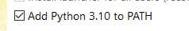

# Mini-Roguelike
>Learning to code should be fun!

This Project is there as learning tool, a tool to teach kids the logic of programming in a fun way, By programming the movement of your character in a game.

##### Table of Contents  
[Installation](#installation)  
[Emphasis](#emphasis)  

## Installation

First of all you need to <a href='https://www.python.org/downloads/'>install Python</a>, It works with <a href='https://www.python.org/downloads/release/python-3101/'>Python 3.10.1</a>, I don't know about other versions
>Make sure that when you are installing python you enable this:
>
>

When you have python installed, install <a href="https://pillow.readthedocs.io/en/stable/installation.html">PIL</a> (Pillow),
If you have Pip installed you can do it by typing this into your console:
>pip install Pillow

<small><i><a href='https://pypi.org/project/Pillow/'>PIL on the Python Package Index</a></i></small>

And the last step: Run <a href="https://github.com/oldmartijntje/Mini-Roguelike/blob/main/setup.py">setup.py</a> which should be installed when you downloaded the Release

### Notes
This uses @oldmartijntje his account system: https://github.com/oldmartijntje/accounts-system

This is a project inspired by:

The robotarm: https://github.com/jeroenslemmer/robotarm-python-2021

Pixeldungeon: http://pixeldungeon.watabou.ru

### explenations
states are generated first, to ensure that the followup level is exactly the same, and that random choices by Program won't change it