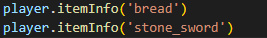

# Mini-Roguelike
>Learning to code should be fun!

This Project is there as learning tool, a tool to teach kids the logic of programming in a fun way, By programming the movement of your character in a game.

##### Table of Contents  
- [Installation](#installation)  
- [How to use](#how-to-use)  
- [How to change content](#how-to-create)  
  + [Level Editor](#level-editor)
  + [GameData Editing](#gamedata-editing)
    - [Preference](#preference)
    - [StartingLoot](#startingLoot)
    - [equippedWeapon](#equippedweapon)
    - [playerStats](#playerstats)
    - [dungeon](#dungeon)
    - [balancing](#balancing)
    - [rarities](#rarities)
    - [chance](#chance)
    - [appSettings](#appsettings)
    - [playerImages](#playerimages)
    - [debug](#debug)
    - [Gamma](#gamma)
    - [text](#text)
    - [tiles](#tiles)
  + [Testing tools](#testing-tools)

## Installation

First of all you need to <a href='https://www.python.org/downloads/'>install Python</a>, It works with <a href='https://www.python.org/downloads/release/python-3101/'>Python 3.10.1</a>, I don't know about other versions.
>Make sure that when you are installing python you enable this:
>
>

When you have python installed, install <a href="https://pillow.readthedocs.io/en/stable/installation.html">PIL</a> (Pillow),
If you have Pip installed you can do it by typing this into your console:
>pip install Pillow

<small><i><a href='https://pypi.org/project/Pillow/'>PIL on the Python Package Index.</a></i></small>

And the last step: Run <a href="https://github.com/oldmartijntje/Mini-Roguelike/blob/main/setup.py">setup.py</a> which should be installed when you downloaded the Release.

There should be code that looks like this in example.py.

You should run it first like this before you change it.

>When you run it an image like this will pop up:
>
>

if you are using other apps using <a href="https://github.com/oldmartijntje/accounts-system">this</a> account system then it's usefull to do what it says, otherwise just click continue.

>After you clicked continue, a menu like this will show up:
>
>

Put it to yes, and you can cange the nme if you want to, but you don't have to change the name.

>After you did that this popup should show up:
>
>

You need to click 'Ok'

>After you did that, this should show up:
>
>

This is the game, you can close it, and the installation process is done.

## How To Use

Open example.py, and your code should go between line 4 and 7:

for different dungeons, put a number here.

>How to move the player:
>
>

When you use these, the character automatically looks in the direction you last moved (even tho it might not look like it because the player only has 2 sprites)

>But if you want to look in a direction without moving, you need to use these instead:
>
>

Moving costs a turn where as looking doesn't, so you can spam looking commands without an enemy ever coming closer. 

>There are also these other easy commands:
>
>
>
>>player.wait() skips your turn
>
>>player.interact() interacts with the world, it can make you talk to a npc, read a sign, attack an enemy, or pickup loot.
>
>>player.showInventory() shows you everything you have in your inventory in the console:
>>
>>
>
>>player.equipWeapon('weaponName') equips a weapon, for example:
>>
>>player.equipWeapon('wooden_sword') to equip the wooden_sword, and the console will give feedback, for example when it can't equip it
>
>>player.useItem('itemNme') you use to use an item, for example:
>>
>>player.useItem('moldy_bread') to consume the moldy_bread
>
>>player.itemInfo('itemName') to get information about the item or weapon, for example:
>>
>>
>>
>>would get this in the console:
>>
>>

>This is autoEquip, The first shows which it is, the second and third sets it to True or false.
>
>What this does is so that when you pickup a better weapon, if it automatically equips it, The default is set to True.
>
>

You can go as advanced as you want to go, by using anything python can do.

>And with these:
>
>

## How to create

This program is highly configurable so i am splitting it into multiple parts
 - [Level Editor](#level-editor)
 - [GameData](#gamedata-editing)
 - [Testing tools](#testing-tools)

## Map Editor

>The level editor is enabled by putting 'Create' (or lowercase) in between the brackets as seen on this picture:
>
>

When enabled you will see something like this:

When you click a square it will change number and color, here is the list of what is what:
 - 0: Air, with a chance to spawn loot or enemy (configurable in json).
 - 1: A wall.
 - 2: Entrance, if you have multiple it will spawn you at the last entrance.
 - 3: Exit, walk through this to go to the next level, a lavel can have multiple exits.
 - 4: High loot chance and normal enemy chance (configurable in json).
 - 5: High enemy chance and normal loot chance (configurable in json).
 - 6: Sign, it will have a message (configurable in multiple ways).
 - 7: Npc, it will have a message (configurable in multiple ways) (might make it be able to walk in the future, so be aware of that when putting it in a map).
 - 8: Nothing spawns here, just air.
 - 9: Bossfight, an enemy which is stronger than a normal enemy with chance of better loot, don't need to defeat it to proceed to next level.

When you are happy with the map, you can export it in 2 ways:
 - export to console:

You can copy the map from the console and easily edit it, but you need to put it in the json yourself later.
 - export to json:

It will automatically be put into the levelData.json, but it will be harder to edit the map from the json since it's one big list of numbers in the json.

This is how it looks in the json:

If you want to give an npc or sign specific text, you can edit the levelList:

>Change it from this:
>
>
>
>To something like this:
>
>
>
>And then the sign will display that text.

The same works with 0, 4, 5 and 9, but instead of text it takse different data:

>0, 4 and 5 have a loot modifier, the higher the number, the higher the chance of better loot (enemy loot drops too). just put it into a list and add a number:
>
>

For 9 it's a bit different since it can take 3 modifiers:

>
>
> - The first one is the modifier for the loot that might spawn on that tile. (put 'NONE' for default)
> - The second one is the modifier for the loot you get when you kill the enemy. (put 'NONE' for default)
> - The third one is the boss difficulty, it ranges from the first number to the last, but if you want it to always be a specific number you can do it by putting it like this:
>
>
>
>You can also just put only 1 modifier if you only want to change 1:
>
>

If you don't put the extra argument there, the sign will pick a random text out of the gameData.json, it's the same with the NPC but they have different texts they pick from.

## GameData Editing

Gamedata is massive so again, i'll make a quick navigation menu:
 - [Preference](#preference)
 - [StartingLoot](#startingLoot)
 - [equippedWeapon](#equippedweapon)
 - [playerStats](#playerstats)
 - [dungeon](#dungeon)
 - [balancing](#balancing)
 - [rarities](#rarities)
 - [chance](#chance)
 - [appSettings](#appsettings)
 - [playerImages](#playerimages)
 - [debug](#debug)
 - [Gamma](#gamma)
 - [text](#text)
 - [tiles](#tiles)

### Preference
Preference is quite small, it hass 2 things:

autoEquipBetter is something you can toggle in game: 

autoEquipBetter means that if you pickup a better weapon than ur currently holdinng, that it will equip the new one. and sleeptime is the time it takes for an enemy to move, if set to 0 everything will happen instantly, and if set to 1, you'll be there for a while.

### StartingLoot

startingLoot can have as many items as you want, make sure that the items also exist in the tiles tho, otherwise it will give errors.

### equippedWeapon
### playerStats
### dungeon
### balancing
### rarities
### chance
### appSettings
### playerImages
### debug
### Gamma
### text
### tiles

## Testing Tools

### Notes
This uses @oldmartijntje his account system: https://github.com/oldmartijntje/accounts-system

This is a project inspired by:

The robotarm: https://github.com/jeroenslemmer/robotarm-python-2021

Pixeldungeon: http://pixeldungeon.watabou.ru

### explenations
states are generated first, to ensure that the followup level is exactly the same, and that random choices by Program won't change it