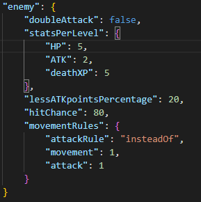

# Code Dungeon
>Learning to code should be fun!

This Project is there as learning tool, a tool to teach kids the logic of programming in a fun way, By programming the movement of your character in a game.

##### Table of Contents  
- [Installation](#installation)  
- [How to use](#how-to-use)  
- [How to change content](#how-to-create)  
  + [Map Editor](#map-editor)
  + [GameData Editing](#gamedata-editing)
    - [Preference](#preference)
    - [StartingLoot](#startingLoot)
    - [equippedWeapon](#equippedweapon)
    - [playerStats](#playerstats)
    - [dungeon](#dungeon)
    - [balancing](#balancing)
    - [rarities](#rarities)
    - [chance](#chance)
    - [appSettings](#appsettings)
    - [playerImages](#playerimages)
    - [debug](#debug)
    - [Gamma](#gamma)
    - [text](#text)
    - [default Tiles](#defaulttiles)
    - [tiles](#tiles)
  + [Testing tools](#testing-tools)
- [Trouble?](#help) 
- [Credits](#credits) 
## Installation

First of all you need to <a href='https://www.python.org/downloads/'>install Python</a>, It works with <a href='https://www.python.org/downloads/release/python-3101/'>Python 3.10.1</a>, I don't know about other versions.
>Make sure that when you are installing python you enable this:
>
>

When you have python installed, install <a href="https://pillow.readthedocs.io/en/stable/installation.html">PIL</a> (Pillow),
If you have Pip installed you can do it by typing this into your console:
>pip install Pillow

<small><i><a href='https://pypi.org/project/Pillow/'>PIL on the Python Package Index.</a></i></small>

And the last step: Run <a href="https://github.com/oldmartijntjeCodeDungeon/blob/main/setup.py">setup.py</a> which should be installed when you downloaded the Release.

There should be code that looks like this in example.py.

You should run it first like this before you change it.

>When you run it an image like this will pop up:
>
>

if you are using other apps using <a href="https://github.com/oldmartijntje/accounts-system">this</a> account system then it's usefull to do what it says, otherwise just click continue.

>After you clicked continue, a menu like this will show up:
>
>

Put it to yes, and you can cange the nme if you want to, but you don't have to change the name.

>After you did that this popup should show up:
>
>

You need to click 'Ok'

>After you did that, this should show up:
>
>

This is the game, you can close it, and the installation process is done.

## How To Use

Open example.py, and your code should go between line 4 and 7:

for different dungeons, put a number here.

>How to move the player:
>
>

When you use these, the character automatically looks in the direction you last moved (even tho it might not look like it because the player only has 2 sprites)

>But if you want to look in a direction without moving, you need to use these instead:
>
>

Moving costs a turn where as looking doesn't, so you can spam looking commands without an enemy ever coming closer. 

>There are also these other easy commands:
>
>
>
>>player.wait() skips your turn
>
>>player.interact() interacts with the world, it can make you talk to a npc, read a sign, attack an enemy, or pickup loot.
>
>>player.showInventory() shows you everything you have in your inventory in the console:
>>
>>
>
>>player.equipWeapon('weaponName') equips a weapon, for example:
>>
>>player.equipWeapon('wooden_sword') to equip the wooden_sword, and the console will give feedback, for example when it can't equip it
>
>>player.useItem('itemNme') you use to use an item, for example:
>>
>>player.useItem('moldy_bread') to consume the moldy_bread
>
>>player.itemInfo('itemName') to get information about the item or weapon, for example:
>>
>>
>>
>>would get this in the console:
>>
>>

>This is autoEquip, The first shows which it is, the second and third sets it to True or false.
>
>What this does is so that when you pickup a better weapon, if it automatically equips it, The default is set to True.
>
>

You can go as advanced as you want to go, by using anything python can do.

>And with these:
>
>

## How to create

This program is highly configurable so i am splitting it into multiple parts
 - [Map Editor](#map-editor)
 - [GameData](#gamedata-editing)
 - [Testing tools](#testing-tools)

## Map Editor

>The level editor is enabled by putting 'Create' (or lowercase) in between the brackets as seen on this picture:
>
>

When enabled you will see something like this:

When you click a square it will change number and color, here is the list of what is what:
 - 0: Air, with a chance to spawn loot or enemy (configurable in json).
 - 1: A wall.
 - 2: Entrance, if you have multiple it will spawn you at the last entrance.
 - 3: Exit, walk through this to go to the next level, a lavel can have multiple exits.
 - 4: High loot chance and normal enemy chance (configurable in json).
 - 5: High enemy chance and normal loot chance (configurable in json).
 - 6: Sign, it will have a message (configurable in multiple ways).
 - 7: Npc, it will have a message (configurable in multiple ways) (might make it be able to walk in the future, so be aware of that when putting it in a map).
 - 8: Nothing spawns here, just air.
 - 9: Bossfight, an enemy which is stronger than a normal enemy with chance of better loot, don't need to defeat it to proceed to next level.

When you are happy with the map, you can export it in 2 ways:
 - export to console:

You can copy the map from the console and easily edit it, but you need to put it in the json yourself later.
 - export to json:

It will automatically be put into the levelData.json, but it will be harder to edit the map from the json since it's one big list of numbers in the json.

This is how it looks in the json:

If you want to give an npc or sign specific text, you can edit the levelList:

>Change it from this:
>
>
>
>To something like this:
>
>
>
>And then the sign will display that text.

The same works with 0, 4, 5 and 9, but instead of text it takse different data:

>0, 4 and 5 have a loot modifier, the higher the number, the higher the chance of better loot (enemy loot drops too). just put it into a list and add a number:
>
>

For 9 it's a bit different since it can take 3 modifiers:

>
>
> - The first one is the modifier for the loot that might spawn on that tile. (put 'NONE' for default)
> - The second one is the modifier for the loot you get when you kill the enemy. (put 'NONE' for default)
> - The third one is the boss difficulty, it ranges from the first number to the last, but if you want it to always be a specific number you can do it by putting it like this:
>
>
>
>You can also just put only 1 modifier if you only want to change 1:
>
>

If you don't put the extra argument there, the sign will pick a random text out of the gameData.json, it's the same with the NPC but they have different texts they pick from.

If you want to make maps a bit more advanced, you can do that. What the game does when it encounters a map number, it creates a dictionary at the cordinate. the dictionary looks like this when empty:

And if you want to create loot, replace the 'NONE' with this: 

To give it text, put one of these:

>
>
>If you put the erray, it will choose one that it always will display once u interact with it.

If you give an enemy or loot text, it will only show the text the first time you interact with it.

This is how you create an enemy:

The item in the entity is what it drops when it dies.

>Like always you can add a list and it will randomly select:
>
>
>
>But you might not want the rat to always be level 10, so if you change it to this:
>
>
>
>It will add the number it chooses, to the base level. (the level all entitys have in that map) (v1.2+)

If you want a map where it has a chance to have a wall, and chance to have air, that's possible.

If you put on the tile a list where the first argument in the list is an '?' and the other arguments in the list are the possabillities it will work:

>
>
>This wil randomly select between air or a wall.

And you can combine it with the dict method too:

>
>
>This wil randomly select between air or this predefined tile.

>If you haven't put in an exit, or start, it will randomly replace an 0 or 8 for an exit and start, unless if you add this in the level list on the first position:
>
>
>
>This is needed if you predefine an exit as dictionary, cause it won't see that as defined exit

#### v1.1.0+

>
>
>You can lock a tile, (doesn't work on moving things, so if there is a lock on an entety only there will be a lock on air) you can lock it by minimum: HP, Strength, Level or needing a specific item
>
>This is not used by default, only when you put a tile in with dictionary

## GameData Editing

Gamedata is massive so again, i'll make a quick navigation menu:
 - [Preference](#preference)
 - [StartingLoot](#startingLoot)
 - [equippedWeapon](#equippedweapon)
 - [playerStats](#playerstats)
 - [dungeon](#dungeon)
 - [balancing](#balancing)
 - [rarities](#rarities)
 - [chance](#chance)
 - [appSettings](#appsettings)
 - [playerImages](#playerimages)
 - [debug](#debug)
 - [Gamma](#gamma)
 - [text](#text)
 - [default Tiles](#defaulttiles)
 - [tiles](#tiles)

### Preference
Preference is quite small, it hass 2 things:

autoEquipBetter is something you can toggle in game: 

autoEquipBetter means that if you pickup a better weapon than ur currently holdinng, that it will equip the new one. and sleeptime is the time it takes for an enemy to move, if set to 0 everything will happen instantly, and if set to 1, you'll be there for a while.

### StartingLoot

startingLoot can have as many items as you want, make sure that the items also exist in the tiles tho, otherwise it will give errors.

### equippedWeapon

This contans which weapon you are using, make sure it's defined in Tiles too, otherwise bugs will happen.

The weight is for the automatic equip better, so that it knows which is better, put it at 0 if you want anything to replace it.

### playerStats

These are self explanetory:

 - "statsPerLevel" is the amount of everything you'll gain for every level
 - "beginStats" is the stats you have at level 0
 - "startLevel" is the level your character has at the beginning
 - "XPneeded" is the amount of xp you need per level

### dungeon

The starting difficulty of the dungeon, which enemys are based off, every floor you go down adds 1 to this number

### balancing

These are settings to balance out the game.
 - "doStrengthDamage"

This means that your strength adds to the attack damage, without it the damage is defined by the wepon you are using and will never get better.
 - "strengthDevidedBy"

This only is usefull when the doStrengthDamage is set to true, this is the amount of damage it does, if its set to 3 and you have 9 strength, it will do 3 attack damage.

### rarities

This is the chance of loot appearing, it's not in percentages, it's in weight, just add any rarity you want.

### chance

These are the chances of things to spawn in maps, the chance of enemies and loot to spawn in air, and in their dedicated tiles (4/5 in the editor)

If you make it 100 or higher it will always spawn

### appSettings
These are app settings, technical stuff.

The offset and size are for the level renderer.

offset is offset in pixels, and size is tilesize.

maxtypes and colors is for the level editor, if you increase mextypes then also add an color, tho adding a maxtype does liturally nothing. Changing colors just changes the colors in the level editor.

The unknown is for when you changed a map using predifined of random choices, obviously you don't want to overwrite those, and you don't want the editor to crash, so these are what it shows for a predefined tile. (v1.2.0+)

### playerImages

These are the textures the player has:

### debug

These are debug settings.
 - Logging, When set to true it will keep the logs, when false, it will delete the logs when closed (but will still be there if it crashes)
 - Combat enables combat.
 - Enemyai enables enemy AI (which is not an AI but an simple algorithm).
 - Sleep means that it takes time delay between enemy movement.
 - Enemy loop is the amount of times it checks to see if an enemy can move (for if another enemy moved out of the way).
 - replayMode writes down every movement you make and item you use/equip, so that you can get to the same place as you once were on that 1 seed. (works same as logging)
 - "enemyLoopPerEnemy" (since v1.2.0) will loop the enemy movement an amount of times, so that it can walk multiple tiles if it has those movement rules.

### Gamma

This is about the view square:

>If you change distance to 4:
>
>

>If you change darknessfull to 0.8 and darknessfade to 0.1:
>
>

>If you change darkness fade and full above 1:
>
>

You can create some funky things with these settings, but you probably don't need to change this like ever.

### text

This is the npc and sign text, the 2 lists it picks random text from if it's not defined in the level code. The default text is quite useless.

### defaultTiles

These are the default walls it will place with the level editor, so if you have multiple wall variations, just add them to the list of 'wall'

They need to be defined in the Tiles to work, otherwise it will crash.

### tiles

Tiles, this is where everything is defined, items, walls, enemies, exits, floors and signs, just everything.

Everything in here has these items:

- "ShowOutsideAs" means which texture it shoud show outside of the viewing area
- "Walkable" can you walk on it? floor yes, wall no
- "Image" The texture it has in the sprites/ folder
- "isEnemy" is it an enemy? (this enables more settings)
- "isInteractable" can you interact with it? like a sign? But it does nothing, you can remove it form the sign but u can still interact with it.
- "isLoot" is it loot? can you pick it up? (this enables more settings)

You can also add a transform dict to tiles:

>
>
>With this you can transform a closed or locked door into an opened door for example.

#### loot:

To show how to do loot i'll show 2 examples, weapon and food.

>
>
>When you enable isLoot to True, you need to add this dictionary.

- "amount" is self explanetory: the amount you'll find per tile.
- "isWeapon" is it a weapon?
- "isConsumable" is it consumable?
- "rarity" How rare is it? (pick one from the rarities you defined or 'NONE' for not generatable loot)

If you set isWeapon to true, you need to add the "weapon" dict:

- "minStrenght" the amount of strenght you need to use the weapon (you can use it earlier but u'll miss 50% and do less damage)
- "attack" the attack damage
- "type" there are 2 types: stab and slice, stab stabs 1 enemy, slice attacks all enemies next to u
- "weaponWeight" the order of defined weapons (for auto equip to know which is better)

If you set isConsumable to true, you need to add the "consumable" dict:

- "restoreHP" (only till v1.0.1) is how much it restores.
- "restoreHPpercentage" (only till v1.0.1) if set to true it will give you ___ % of your max HP back, and if it's false it will give you __ HP back.
- "type" + or - or % or set HP
- "HPAmount" the amount of HP

>
>
>You can also add this dictionary
> - "nextFloor" will instantly warp you to the next floor.

#### enemy:

When you put "isEnemy" to true, you need to add this dictionary:

- "doubleAttack" it's true it can double attack (until v1.2)
- "statsPerLevel" the stats this enemy will have per level
- "lessATKpointsPercentage" the percentage of damage variaton, the ATK minus 0% to this% 
- "hitChance" the chance for the enemy to hit
- "movementRules" does something since v1.2:

>
>
>The 'insteadOf' means that it's either 1 or the other:
>
>It either moves 1 to 3 tiles or attacks 4 times
>
>But if you set it to 'and' it will be:
>
>
>
>move 1 tile and then attack twice, or attack twice and don't move.

If not set to 'and' or 'insteadOf' it can't attack, but can still move.

## Testing Tools

>Want to quickly load a specific level:
>
>

>Want to load a specific level from the levelData:
>
>

>Want to load a big empty level:
>
>

>Want to load a big level where everything is an exit:
>
>

>Other level functions work like this too:
>
>

>When using the dict like ths, make sure it has // instead of the x, and make sure it's a valid json string:
>
>

## help

Go to the <a href = https://github.com/oldmartijntje/CodeDungeon/blob/main/troubleshooting.md>TroubleShooting.md</a> for error codes and how to solve them.

## Credits
This uses @oldmartijntje his account system: https://github.com/oldmartijntje/accounts-system

This is a project inspired by:

The robotarm: https://github.com/jeroenslemmer/robotarm-python-2021

Pixeldungeon: http://pixeldungeon.watabou.ru

